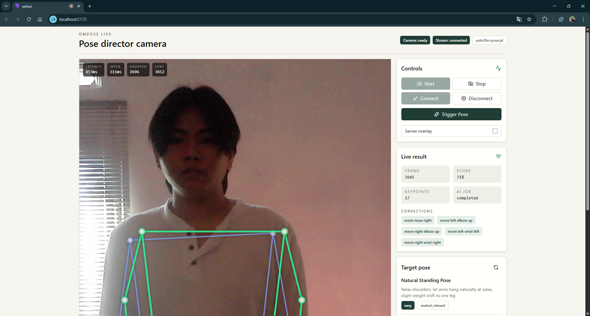

<div align="center">

# 🧘 OmPose

**AI-Powered Real-Time Pose Director**

A smart camera system that detects body poses in real-time, understands environmental context through a Vision Language Model, and provides natural pose guidance — like having your own professional photographer.

<!-- TODO: Replace placeholders below with actual project screenshots -->



*OmPose Live dashboard — real-time pose detection, target skeleton overlay, and AI-driven pose recommendations*


*Pipeline: Camera → YOLO Pose Detection → VLM Scene Analysis → Pose Guide Engine → Real-time Feedback*

---

[](https://python.org)
[](https://fastapi.tiangolo.com)
[](https://react.dev)
[](https://docs.ultralytics.com)
[](https://help.aliyun.com/zh/dashscope/)

</div>

---

## 📋 Table of Contents

- [About the Project](#-about-the-project)
- [Problem Statement](#-problem-statement)
- [Use Cases](#-use-cases)
- [Architecture & Approach](#-architecture--approach)
- [Key Features](#-key-features)
- [Tech Stack](#-tech-stack)
- [Installation & Setup](#-installation--setup)
- [Usage](#-usage)
- [Current Challenges](#-current-challenges)
- [What I Learned](#-what-i-learned)
- [Development Suggestions](#-development-suggestions)
- [Project Structure](#-project-structure)
- [License](#-license)

---

## 💡 About the Project

**OmPose** is an AI system that combines **pose estimation** (YOLO) with a **Vision Language Model** (Qwen VL) to deliver real-time pose recommendations. It acts as a "pose director" — analyzing the user's current body pose, understanding the surrounding environment (indoor/outdoor, lighting, mood), and suggesting poses that fit the context, complete with a visual skeleton overlay as guidance.

Unlike typical pose estimation apps that only detect, OmPose **actively provides feedback** — displaying a target skeleton on screen and computing a **pose match score** so users know exactly how close they are to the suggested pose.

---

## 🎯 Problem Statement

### "I want to take a photo but I have no idea what pose to do"

A classic problem almost everyone has experienced:

| Problem | How OmPose Helps |
|---|---|
| No idea which pose suits a particular location | VLM analyzes the scene (indoor/outdoor, lighting, mood) and recommends contextual poses |
| No photographer to give direction | Real-time skeleton overlay acts as a visual guide — like professional direction |
| Can't tell if the pose looks right | Live pose match score shows alignment percentage in real-time |
| Photos often look stiff or unnatural | Recommendations are based on pre-designed templates crafted for natural-looking poses |
| Too much trial-and-error | Real-time feedback dramatically speeds up the pose iteration process |

---

## 🧩 Use Cases

- **Solo Travelers** — Get professional pose directions while photographing yourself at tourist spots, no stranger needed
- **Content Creators** — Quick, contextual pose variations for content across different locations
- **Beginner Photographers** — Learn to direct a model's pose using visual skeleton references
- **Photo Booths & Events** — Interactive pose guidance for event guests
- **Body Language Learning** — Understand natural body positioning through skeleton visualization

---

## 🏗 Architecture & Approach

```
┌─────────────────┐     WebSocket      ┌──────────────────────────────────┐
│                  │  ◄──────────────►  │         FastAPI Backend          │
│   React WebUI    │     JPEG frames    │                                  │
│   (Vite + TS)    │   ◄── overlay ──   │  ┌──────────┐  ┌─────────────┐  │
│                  │   ── pose data ──► │  │ YOLO v26 │  │ VLM Reasoner│  │
│  • Camera feed   │                    │  │ Pose Det.│  │ (Qwen3-VL)  │  │
│  • Skeleton draw │     REST API       │  └────┬─────┘  └──────┬──────┘  │
│  • Score display │  ◄──────────────►  │       │               │         │
│  • Photo capture │   recommendations  │  ┌────▼───────────────▼──────┐  │
│                  │                    │  │    Pose Guide Engine       │  │
└─────────────────┘                    │  │  (template-based target    │  │
                                       │  │   keypoint generation)     │  │
                                       │  └────────────────────────────┘  │
                                       └──────────────────────────────────┘
```

### Approaches Used

1. **Hybrid AI Pipeline** — Combines a local model (YOLO for speed) with a cloud VLM (Qwen for reasoning). YOLO handles real-time pose detection on every frame, while the VLM is called only once for scene analysis and pose recommendation.

2. **Template-Based Pose Generation** — Instead of asking the VLM to generate keypoints directly (which tends to be inaccurate), the VLM selects from a **pre-defined pose template catalog**. The `PoseGuideEngine` then adapts the chosen template based on the **user's actual body proportions** (arm length, shoulder width, etc.).

3. **WebSocket Streaming** — Frames are sent via WebSocket for low latency. The backend processes only the latest frame (dropping older ones) to maintain responsiveness.

4. **Pose Smoothing** — Exponential moving average applied to keypoints to eliminate skeleton jittering on screen.

---

## ✨ Key Features

| Feature | Description |
|---|---|
| 🎥 **Real-Time Pose Detection** | YOLO v26n-pose detects 17 body keypoints from webcam stream |
| 🧠 **AI Scene Understanding** | Qwen3-VL analyzes the photo to understand scene, lighting, and mood |
| 🎯 **Smart Pose Recommendations** | Contextual pose suggestions based on scene + current pose |
| 💀 **Dual Skeleton Overlay** | Blue skeleton = current pose, Green skeleton = target pose |
| 📊 **Live Pose Match Score** | Real-time alignment percentage between actual pose vs target |
| 📸 **Photo Capture** | Shutter button to capture photos — preview, download, and delete |
| 🔄 **Server Overlay Mode** | Option to render overlay server-side (more precise) or client-side (faster) |
| 🖥 **CLI Mode** | Pipeline can be run via command line for batch processing |

---

## 🛠 Tech Stack

### Backend (Python)
| Component | Technology |
|---|---|
| Web Framework | FastAPI + Uvicorn |
| Pose Detection | YOLO v26n-pose (Ultralytics) |
| Vision LLM | Qwen3-VL-Plus via DashScope API |
| Image Processing | OpenCV + Pillow |
| Real-time Comm. | WebSocket (native FastAPI) |
| Data Validation | Pydantic v2 |

### Frontend (TypeScript)
| Component | Technology |
|---|---|
| Framework | React 19 + Vite |
| Styling | TailwindCSS v4 |
| UI Components | Custom components (Badge, Button, Panel) |
| Icons | Lucide React |
| Camera & Canvas | Web APIs (getUserMedia, Canvas 2D) |

---

## ⚡ Installation & Setup

### Prerequisites

- Python 3.11+
- Node.js 20+
- API Key from [DashScope (Alibaba Cloud)](https://dashscope.console.aliyun.com/)
- Webcam (for live mode)

### 1. Clone Repository

```bash
git clone https://github.com/your-username/OmPose.git
cd OmPose
```

### 2. Setup Backend

```bash
# Create virtual environment
python -m venv .venv
source .venv/bin/activate  # Linux/Mac
# .venv\Scripts\activate   # Windows

# Install dependencies
pip install -r requirements.txt
```

### 3. Download YOLO Model

Download the YOLO pose model to `assets/models/`:

```bash
mkdir -p assets/models

# Download YOLO v26n-pose (7.8MB, lightweight)
python -c "from ultralytics import YOLO; YOLO('yolo26n-pose.pt')"
mv yolo26n-pose.pt assets/models/
```

### 4. Configure Environment

```bash
# Copy env example
cp .env.example .env

# Edit .env and fill in your API key
nano .env
```

**Required:**
```env
DASHSCOPE_API_KEY=sk-your-actual-api-key-here
```

### 5. Setup Frontend

```bash
cd webui

# Install dependencies
npm install

# Copy env example
cp .env.example .env
```

### 6. Run

Open **2 separate terminals**:

**Terminal 1 — Backend:**
```bash
cd OmPose
source .venv/bin/activate
uvicorn src.api.app:app --host 0.0.0.0 --port 8080
```

**Terminal 2 — Frontend:**
```bash
cd OmPose/webui
npm run dev
```

Open your browser → `http://localhost:5173`

### 7. CLI Mode (Optional)

```bash
python main.py path/to/photo.jpg --recommendations 3 --out output/
```

---

## 🚀 Usage

### Live Mode (Webcam)

1. **Start Camera** — Click `Start` to activate the webcam
2. **Connect Stream** — Click `Connect` to begin streaming to the backend (pose detection activates)
3. **Trigger Pose** — Click `Trigger Pose` to have the AI analyze the scene and recommend a pose
4. **Follow the Green Skeleton** — Adjust your body to match the green target skeleton on screen
5. **Monitor Score** — Check the "Pose match" score at the bottom-left — aim for above 80%
6. **Capture** — Press the shutter button (white circle, bottom-right) when your pose matches
7. **Review** — View captures in the "Captures" panel — click a thumbnail for full-size view

### Tips

- Make sure your full body is visible in the frame for optimal detection
- Good lighting significantly improves detection accuracy
- Use "Server overlay" mode for more precise rendering
- A pose match above 85% generally looks natural in photos

---

## ⚠️ Current Challenges

### 1. Target Keypoint Accuracy on Complex Poses
The template-based approach works well for standard poses (standing, sitting), but for more complex poses (bending, twisting), the generated target keypoints can be inaccurate. VLMs can't reliably produce precise coordinates, so the system still relies on a limited template catalog.

### 2. Latency Trade-off
There's a fundamental trade-off between accuracy and speed:
- YOLO v26n-pose is fast (~15-25ms) but less precise than larger models
- VLM calls take 2-5 seconds per request — too slow for real-time, so it's only called once on "Trigger Pose"
- Server overlay rendering adds latency due to image encoding/decoding

### 3. Seated vs Standing Detection
The heuristic for detecting whether the user is sitting or standing is still simplistic (based on Y-position of hips and knees). It occasionally misclassifies at certain camera angles, causing inappropriate pose template selection.

### 4. Single Person Only
The system currently supports only one person in the frame. Multi-person pose guidance is not yet implemented.

### 5. In-Memory Capture Storage
Captured photos are only stored in server memory — they are lost on restart. There is no persistent storage yet.

---

## 📚 What I Learned

Building OmPose taught me a number of valuable lessons:

### 1. Combining Multiple AI Models
Learned how to integrate a local pose detection model (YOLO) with a cloud-based VLM (Qwen) in a single pipeline. The key insight is **understanding each model's strengths** — YOLO for speed, VLM for reasoning — and designing an architecture that leverages both optimally.

### 2. WebSocket Real-Time Streaming
Understood the **producer-consumer pattern** with a frame buffer that keeps only the latest frame (dropping old ones). This is crucial for responsiveness — processing 1 fresh frame is always better than queuing 10 stale ones.

### 3. Prompt Engineering for Structured Output
VLMs don't always return valid JSON. It requires:
- Highly specific prompts about the expected output format
- A **JSON repair mechanism** — if parsing fails, ask the VLM to fix its own JSON
- Strict validation with Pydantic schemas

### 4. Keypoint Math & Body Proportions
Learned fundamental human body proportion geometry — how to compute body segment lengths from normalized keypoints, and how to generate target keypoints that are proportional to the user's actual body measurements.

### 5. Pose Smoothing (Signal Processing)
Applied exponential moving average on keypoint coordinates to reduce jittering. An alpha of 0.45 turned out to be a good balance between responsiveness and smoothness.

### 6. FastAPI + React Full-Stack
Built a complete full-stack application with a FastAPI backend and React frontend communicating via both REST API and WebSocket simultaneously. This included handling CORS, file uploads, and async task management.

### 7. Canvas 2D Programming
Drew human skeletons on HTML Canvas — line connections, joint circles, shadow effects, and transparency blending. Also learned about the `requestAnimationFrame` loop for smooth rendering.

---

## 🔮 Development Suggestions

For anyone looking to extend this project further:

### 🟢 Easy
- [ ] **Persistent capture storage** — Save photos to disk or cloud storage instead of memory only
- [ ] **Pose history** — Save a log of attempted poses along with their scores
- [ ] **Sound feedback** — Play a notification sound when the pose match score passes a threshold
- [ ] **Timer countdown** — Auto-capture after the pose remains stable for X seconds

### 🟡 Intermediate
- [ ] **Pose template editor** — A UI for adding/editing pose templates without coding
- [ ] **Multi-camera support** — Choose between front/back camera on mobile devices
- [ ] **Pose comparison view** — Side-by-side view of the target pose vs the actual pose
- [ ] **Export timelapse** — Combine captures into a timelapse video
- [ ] **Offline VLM** — Replace cloud-based Qwen with a local GGUF model (e.g., LLaVA)

### 🔴 Challenging
- [ ] **Multi-person pose** — Detect and guide multiple people simultaneously (couple/group poses)
- [ ] **3D pose estimation** — Use depth cameras or 3D models for more accurate positioning
- [ ] **Pose transfer** — Upload a reference photo, extract its pose, and use it as the target
- [ ] **AR overlay** — Display pose guidance in augmented reality
- [ ] **Training mode** — A learning system that adapts to the user's pose preferences over time

---

## 📁 Project Structure

```
OmPose/
├── main.py                  # CLI entry point
├── requirements.txt         # Python dependencies
├── .env.example             # Environment variables template
│
├── src/
│   ├── api/
│   │   ├── app.py           # FastAPI app + all endpoints
│   │   └── schemas.py       # Request/response schemas
│   ├── streaming/
│   │   ├── session.py       # WebSocket streaming session
│   │   └── scoring.py       # Pose alignment scoring
│   ├── models/
│   │   ├── schemas.py       # Pydantic data models
│   │   └── prompts.py       # VLM prompt templates
│   ├── pipeline.py          # Main OmPose pipeline orchestrator
│   ├── pose_detector.py     # MediaPipe pose detector
│   ├── yolo_pose_detector.py # YOLO v26 pose detector
│   ├── vlm_reasoner.py      # DashScope VLM integration
│   ├── pose_guide_engine.py # Template-based target pose generator
│   ├── marker_renderer.py   # Skeleton overlay renderer
│   └── image_io.py          # Image loading utilities
│
├── webui/
│   ├── src/
│   │   ├── App.tsx          # Main React component
│   │   ├── lib/
│   │   │   └── ompose-api.ts # Backend API client
│   │   └── components/
│   │       └── ui/          # Reusable UI components
│   ├── .env.example         # Frontend env template
│   └── package.json
│
├── assets/
│   └── models/              # YOLO model weights (not in git)
│
└── tests/                   # Test suite
```

---

## 📝 License

This project was built for learning and experimentation purposes. Feel free to use and modify it as needed.

---

<div align="center">

**Built with ☕ and curiosity**

*OmPose — because everyone deserves good pose direction.*

</div>
